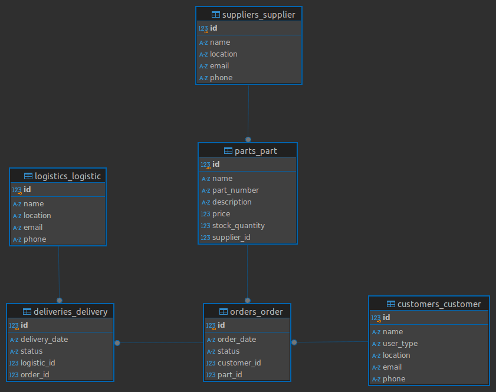

---

# SparePal

SparePal is a platform that connects users with genuine, high-quality parts from trusted suppliers.

## ER Diagram


## Project Structure
```
spare-pal/
├── core
├── db.sqlite3
├── manage.py
├── requirements.txt
├── static
├── suppliers
└── venv
```

## Steps to Run the Django App

1. **Clone the Repository**
   ```bash
   git clone https://github.com/abdi-bb/spare-pal.git
   cd spare-pal
   ```

2. **Create a Virtual Environment**
   If you haven't already created a virtual environment, do so with:
   ```bash
   python -m venv venv
   ```

3. **Activate the Virtual Environment**
   - On macOS and Linux:
     ```bash
     source venv/bin/activate
     ```

4. **Install Requirements**
   Once your virtual environment is activated, install the necessary dependencies:
   ```bash
   pip install -r requirements.txt
   ```

5. **Apply Migrations**
   Set up the database by applying migrations:
   ```bash
   python manage.py migrate
   ```

6. **Create a Superuser (Optional)**
   If you want to access the admin interface, create a superuser:
   ```bash
   python manage.py createsuperuser
   ```

7. **Run the Development Server**
   Start the Django development server:
   ```bash
   python manage.py runserver
   ```

8. **Access the API**
   Open your browser and navigate to:
   - [API Documentation](http://localhost:8000/api)

9. **Access Swagger UI**
   Open your browser and navigate to:
   - [Swagger UI](http://127.0.0.1:8000/api/schema/swagger-ui/)
   
   Or
   
   - [ReDoc Documentation](http://127.0.0.1:8000/api/schema/redoc/)

---
